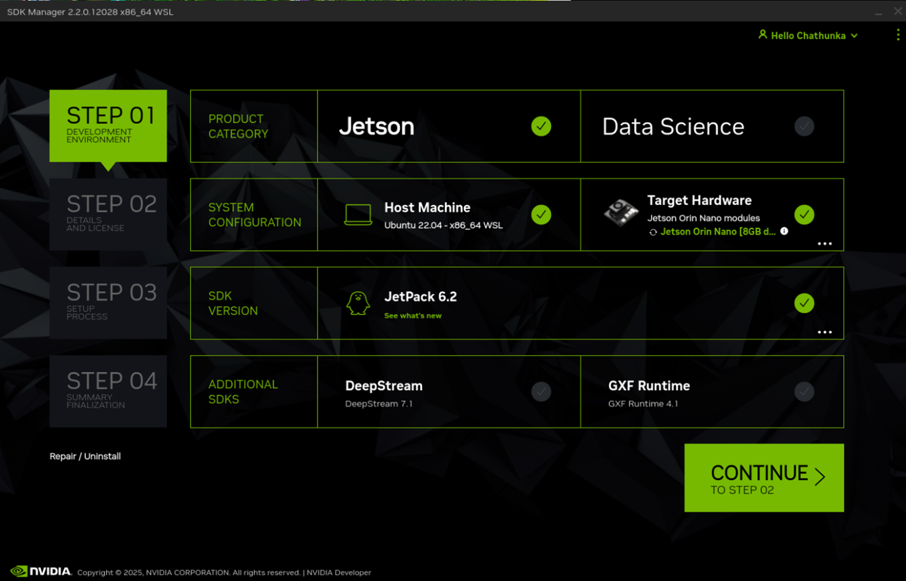
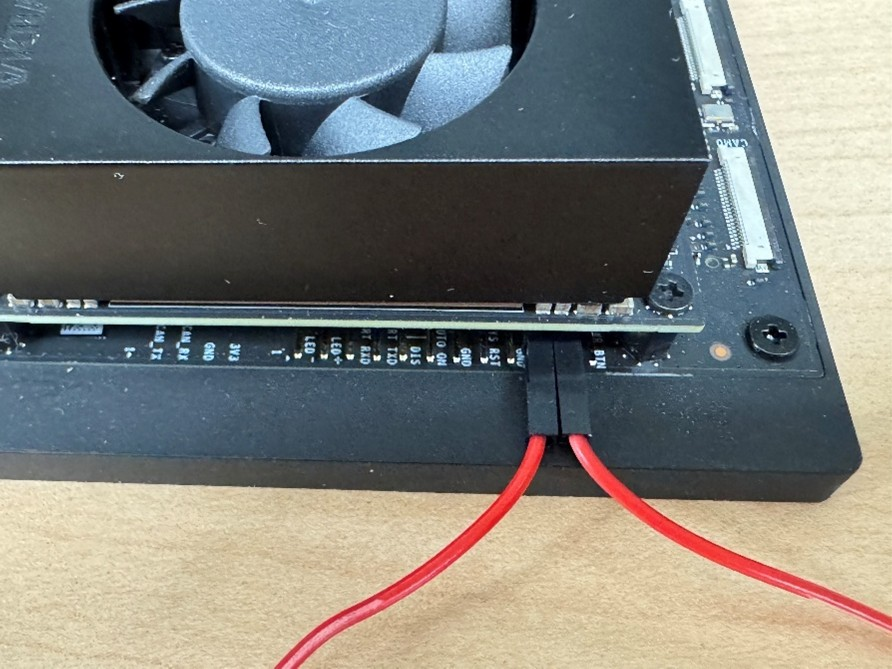
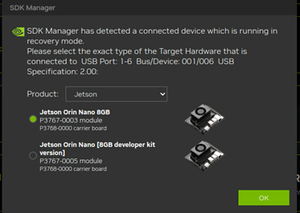
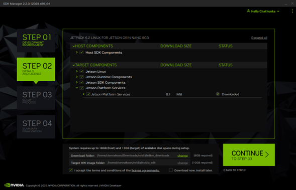

# 🧠 OS and Driver Setup Procedure for NVIDIA Jetson Orin Nano

## 📚 Contents

* [🛠️ Prerequisites](#️-prerequisites)
* [📥 Step 1: Download JetPack 5.1.3 SD Card Image](#step-1-download-jetpack-513-sd-card-image)
* [💾 Step 2: Flash JetPack 5.1.3 to microSD Card](#step-2-flash-jetpack-513-to-microsd-card)
* [🔄 Step 3: Boot Jetson Orin Nano with JetPack 5.1.3](#step-3-boot-jetson-orin-nano-with-jetpack-513)
* [🔧 Step 4: Update Firmware (QSPI)](#step-4-update-firmware-qspi)
* [📥 Step 5: Download JetPack 6.2 SD Card Image](#step-5-download-jetpack-62-sd-card-image)
* [💾 Step 6: Flash JetPack 6.2 to microSD Card](#step-6-flash-jetpack-62-to-microsd-card)
* [🔄 Step 7: Boot Jetson Orin Nano with JetPack 6.2](#step-7-boot-jetson-orin-nano-with-jetpack-62)
* [🚀 Step 8: Enable MAXN SUPER Performance Mode](#step-8-enable-maxn-super-performance-mode)
* [🧪 Step 9: Verify Performance Mode](#step-9-verify-performance-mode)
* [🧰 Optional: Install NVMe SSD and Boot from SSD](#optional-install-nvme-ssd-and-boot-from-ssd)
* 🚀 Boot JetPack 6.2 from NVMe SSD (via SDK Manager)

> ⚠️ **Note:** This guide is based on NVIDIA's official documentation. For latest updates, refer to:
> [Official Setup Guide – Jetson AI Lab](https://developer.nvidia.com/embedded/jetpack)

---

### 🛠️ Prerequisites

**Hardware Requirements:**

* Jetson Orin Nano Developer Kit
* microSD card (64GB or larger)
* (Optional) NVMe SSD
* USB keyboard and mouse
* DisplayPort monitor
* 12V DC power adapter

**Software Requirements:**

* Windows PC with internet access
* Balena Etcher (for flashing SD cards)[Balena Etcher](https://www.balena.io/etcher/)

---

### 📥 Step 1: Download JetPack 5.1.3 SD Card Image

1. On your Windows PC, go to [NVIDIA JetPack SDK](https://developer.nvidia.com/downloads/embedded/l4t/r35_release_v5.0/jp513-orin-nano-sd-card-image.zip).
2. Download the **JetPack 5.1.3 SD Card image** for Jetson Orin Nano.

---

### 💾 Step 2: Flash JetPack 5.1.3 to microSD Card

1. Insert the microSD card into your Windows PC.
2. Open **Balena Etcher**.
3. Select the JetPack 5.1.3 image.
4. Choose the target SD card.
5. Click **Flash**.

---

### 🔄 Step 3: Boot Jetson Orin Nano with JetPack 5.1.3

1. Insert the microSD into the Jetson Orin Nano.
2. Connect keyboard, mouse, and monitor.
3. Power on the device.
4. Complete the Ubuntu setup wizard.

---

### 🔧 Step 4: Update Firmware (QSPI)

1.	Open a terminal on the Jetson Orin Nano.

```bash
sudo /opt/nvidia/l4t-bootloader-config/nv-l4t-bootloader-config.sh
sudo reboot
```
2. Upon reboot, the firmware update will start automatically. Wait for it to complete.
---

### 📥 Step 5: Download JetPack 6.2 SD Card Image

1. On your Windows PC, revisit the [JetPack SDK page](https://developer.nvidia.com/downloads/embedded/l4t/r36_release_v4.3/jp62-orin-nano-sd-card-image.zip).
2. Download the **JetPack 6.2 SD card image**.

---

### 💾 Step 6: Flash JetPack 6.2 to microSD Card

1. Insert a (new or reused) microSD card into your Windows PC.
2. Open **Balena Etcher**.
3. Select the JetPack 6.2 image.
4. Choose the correct SD card.
5. Click **Flash**.

---

### 🔄 Step 7: Boot Jetson Orin Nano with JetPack 6.2

1. Insert the JetPack 6.2 microSD into Jetson.
2. Power it on and complete setup.
3. Verify installation:

```bash
cat /etc/nv_tegra_release
# Expected output: JetPack 6.2, L4T 36.4.3
```

4. Schedule a firmware update:

```bash
sudo /opt/nvidia/l4t-bootloader-config/nv-l4t-bootloader-config.sh
sudo reboot
```

5.	Wait for the update process to complete after reboot.
---

### 🚀 Step 8: Enable MAXN SUPER Performance Mode

1.	Open a terminal on the Jetson Orin Nano. Remove the existing power mode configuration and Switch to MAXN SUPER mode:

```bash
sudo rm -rf /etc/nvpmodel.conf
sudo nvpmodel -m 2
```
This mode enables the highest performance available.
---

### 🧪 Step 9: Verify Performance Mode

1. Click the NVIDIA icon in the Ubuntu panel.
2. Select **Power Mode** → **MAXN SUPER**.

---

### 🧰 Optional: Install NVMe SSD and Boot from SSD

#### 🔌 A. Install NVMe SSD

1. Power off Jetson and unplug peripherals.
2. Insert SSD into M.2 slot.
3. Reconnect and power on.
4. Confirm detection:

```bash
lspci
# Expected output:
# 0007:01:00.0 Non-Volatile memory controller: Marvell...
```

#### 🧾 B. Format and Mount the SSD

```bash
lsblk             # Locate your SSD, e.g., /dev/nvme0n1
sudo mkfs.ext4 /dev/nvme0n1
sudo mkdir /ssd
sudo mount /dev/nvme0n1 /ssd
```

#### 🔁 C. Auto-Mount SSD on Boot

1. Get UUID:

```bash
lsblk -f
```

2. Edit `/etc/fstab`:

```ini
UUID=<your-uuid> /ssd ext4 defaults 0 0
```

---

### 🚀 Boot JetPack 6.2 from NVMe SSD (via SDK Manager)

#### 🛠️ Requirements

* Ubuntu host PC with internet
* NVIDIA SDK Manager installed [SDK Manager](https://developer.nvidia.com/nvidia-sdk-manager)
* Jetson developer kit (e.g., Jetson Orin Nano)
* USB-C cable for flashing (or micro-USB for older devices)
* NVMe SSD properly inserted into the Jetson device


#### 🔧 1. Install and Launch SDK Manager

* Install and launch the SDK Manager (use terminal):
```bash
sudo apt install ./sdkmanager_2.2.0-12028_amd64.deb
sudo sdkmanager
```
* Log in with your NVIDIA Developer account in the Welcome window (GUI).
   
#### 🧩 2. Select JetPack 6.2 and Jetson Orin Nano

* Choose **JetPack 6.2**
* Select your **Jetson Orin Nano** device



#### 🖥️ 3. Connect Jetson in Recovery Mode

* Power off your Jetson device.
* Connect the Jetson to your host PC using a USB-C cable.
* Use a jumper wire to short FC_REC to GND
* Then connect the power to the Jetson board.





#### ⚙️ 4. Set Installation to NVMe

In SDK Manager:
* On the installation options page in SDK Manager, select the required components.
* Accept the Terms and Conditions, then click Continue.



* When prompted, set a username and password for your Jetson Orin Nano
* Under Storage Device, select **“NVMe”** as the target for flashing.
* Enable **“Flash to NVMe SSD”**

#### 🔄 5. Flash and Wait

* Click Flash and wait for the installation to complete.
SDK Manager flashes JetPack 6.2 to the NVMe. Wait until complete.

#### 🔌 6. Initial Setup on First Boot

* After flashing is complete, disconnect the USB cable and remove power from the Jetson board.
* Remove the jumper wire from the recovery mode pins.
* Connect a display, keyboard, and mouse to the Jetson Orin Nano.
* Reconnect the power cable to boot the device.

```bash
df -h /
# Ensure root is /dev/nvme0n1p1
```
#### 🚀 You're Done!
Your Jetson device is now booting entirely from the NVMe SSD with JetPack 6.2.

---
